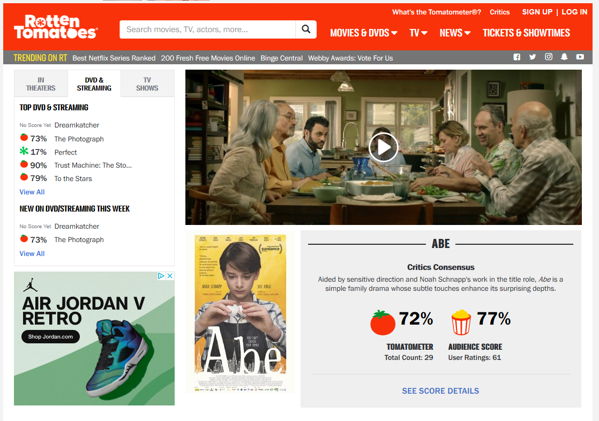

# Movie review sentiment analysis
This project uses NLP to analyze movie review attitude. The core parts are using TfidfVectorizer to find the most important features and useing SGDClassifer to predict the sentiment.

## Prerequisites

Python packages required: nltk, sklearn, spacy

## Steps

1. load data
The data is from movie_reviews in nltk, which can be accessed by code nltk.download("movie_reviews")

2. train and test datasets
Usually we split data into train and test datasets. Train data is used to select model, but we also save unseen test data to evaluate the model performance.

3. model selection
GridSearch is used to tune the hyperparameters in the model. 

4. model prediction
I select some of reviews for movie <Abe> from Rotten Tomatoes to predict the reviewers' sentiment attitude.

